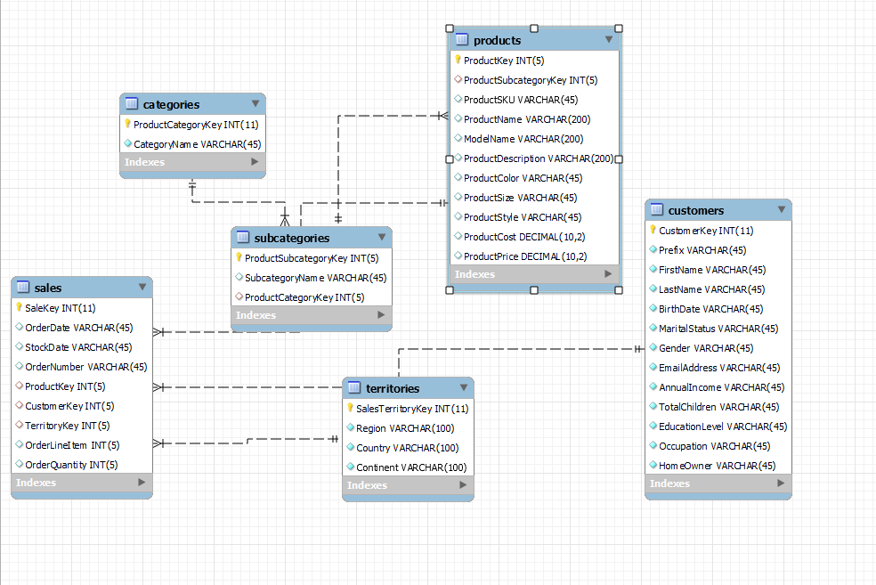

CANDIDATO: TIAGO SOUZA PAIVA

TAREFA 1

* REQUIREMENTS
1. O sistema de banco de dados escolhido foi o MySQL, instalado por meio do XAMPP versão 3.3.0.
2. O software de gerenciamento de banco de dados escolhido foi o MySQL WorkBench versão 8.0.
3. Para manipular e importar os dados brutos usei Python  e a biblioteca SQLAlchemy.


* DIAGRAMA
     
    
O diagrama esta salvo no 'AdventureWorks-Model.mwb'


* BANCO DE DADOS

   Eu criei um SCHEMA com o nome de 'adventureworks', e uma table para cada arquivo .csv que foi fornecido,
   nas tabelas cada coluna foi nomeada exatamente igual aos valores de cabeçalho dos arquivos .csv.
   Caso seja necessário para uma importação futura, o arquivo .SQL do banco de dados esta salvo na pasta 'TAREFA 1' como
   'adventureworks.sql'. Para enviar os dados para o servidor escrevi um script (send_data.py) em python e SQLAlchemy.  

TAREFA 2

* TOP 10 PRODUTOS NA CATEGORIA BICICLETAS:

Criei essa Query para a busca:

````
SELECT subcategories.ProductSubcategoryKey, products.ProductKey, sales.*, COUNT(*) AS total_repeticoes
FROM sales
JOIN products ON sales.ProductKey = products.ProductKey
JOIN subcategories ON products.ProductSubcategoryKey = subcategories.ProductSubcategoryKey
JOIN categories ON subcategories.ProductCategoryKey = categories.ProductCategoryKey
WHERE categories.ProductCategoryKey = 1
GROUP BY sales.ProductKey
ORDER BY total_repeticoes DESC
LIMIT 10;
````

e como retorno exportei o resultado em formato .csv ('top-10-produtos-bicicletas.csv' na pasta 'TAREFA2').


* TOP 1 CLIENTE EM NUMERO DE VENDAS

Criei essa Query para a busca:
````commandline
SELECT customers.*, COUNT(sales.CustomerKey) AS compras
FROM customers
JOIN sales ON customers.CustomerKey = sales.CustomerKey
GROUP BY customers.CustomerKey
ORDER BY compras DESC
LIMIT 1;
````
e como retorno exportei o resultado em formato .csv ('top-1-cliente.csv' na pasta 'TAREFA2').

* TOP 1 MES DE VENDAS

Criei essa Query para a busca:
```
SELECT MONTH(sales.OrderDate) AS mes, COUNT(*) as total_vendas
FROM sales
GROUP BY mes
ORDER BY total_vendas DESC
LIMIT 1;
```
e como retorno exportei o resultado em formato .csv ('top-1-mes-vendas.csv' na pasta 'TAREFA2').

* TOP 1 VENDEDORES

Infelizmente os dados necessários para essa query, não estão presentes no conjunto de dados fornecidos,
mas foram passados os dados das regioes, então elaborei uma query que seleciona a região com o maior numero
de vendas. Logo da pra saber a região que possui os vendedores com maior desempenho.
Segue a QUERY:

```commandline
SELECT territories.*, COUNT(sales.TerritoryKey) AS Vendas_por_Territorio
FROM territories
JOIN sales ON territories.SalesTerritoryKey = sales.TerritoryKey
GROUP BY territories.SalesTerritoryKey
ORDER BY Vendas_por_Territorio DESC
LIMIT 1;
```
e como retorno exportei o resultado em formato .csv ('top-1-vendas-p-regiao.csv' na pasta 'TAREFA2')